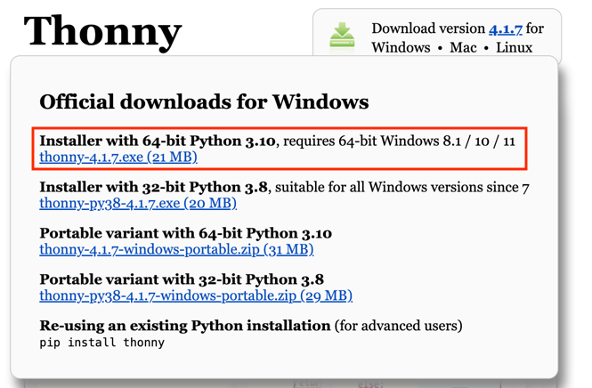
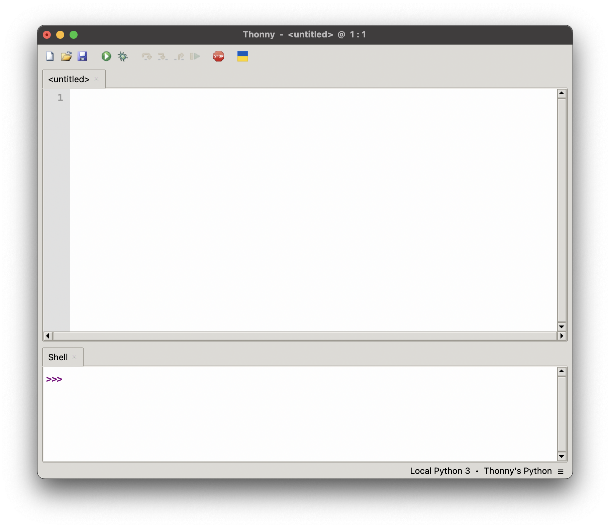

# Thonny

Voordat we kunnen beginnen met programmeren in Python, hebben we een programma
nodig waarin we onze code kunnen schrijven en uitvoeren. Zo'n programma noemen
we een **IDE**, wat staat voor *Integrated Development Environment*. Voor
beginnende programmeurs is **Thonny** een uitstekende keuze. Thonny is speciaal
gemaakt voor wie nog nooit eerder heeft geprogrammeerd. Het programma heeft een
overzichtelijke interface, handige foutmeldingen en een eenvoudige manier om
code stap voor stap uit te voeren.

## Doel van deze les

- [ ] Thonny installeren en openen.  
- [ ] De basisinterface van Thonny begrijpen.

## Installeren

Volg de stappen hieronder om Thonny op je computer te installeren. Dit hoef je
maar één keer te doen.

### Stappen

1. Ga naar de website [thonny.org](https://thonny.org).
2. Beweeg met de muis over **Windows** (of **Mac**, als je een MacBook gebruikt).
3. Er verschijnt nu een menu. Klik op de **bovenste optie** om het installatiebestand te downloaden.
4. Wacht tot het downloaden klaar is. Open daarna het bestand en volg de stappen om Thonny te installeren.
5. Na de installatie kun je Thonny openen via het **startmenu** (of via Spotlight op een Mac).

> [!TIP]
> Gebruik je een MacBook? Ga dan op de website met je muis over het kopje
> **Mac** en klik op de downloadknop daar.

## Eerste keer opstarten

Wanneer je Thonny voor het eerst opent, zie je een scherm zoals hieronder:

- **Bovenaan**: Hier typ je je code.
- **Onderin (Shell)**: Hier zie je de uitvoer van je code.
- **Groene knop met pijl**: Hiermee start je de code.

## Klaar

Als alles goed is gegaan, heb je nu Thonny geïnstalleerd en kun je het openen.
In de volgende opdracht gaan we ons eerste programma schrijven in Python: het
beroemde **Hello, world!**-programma.
