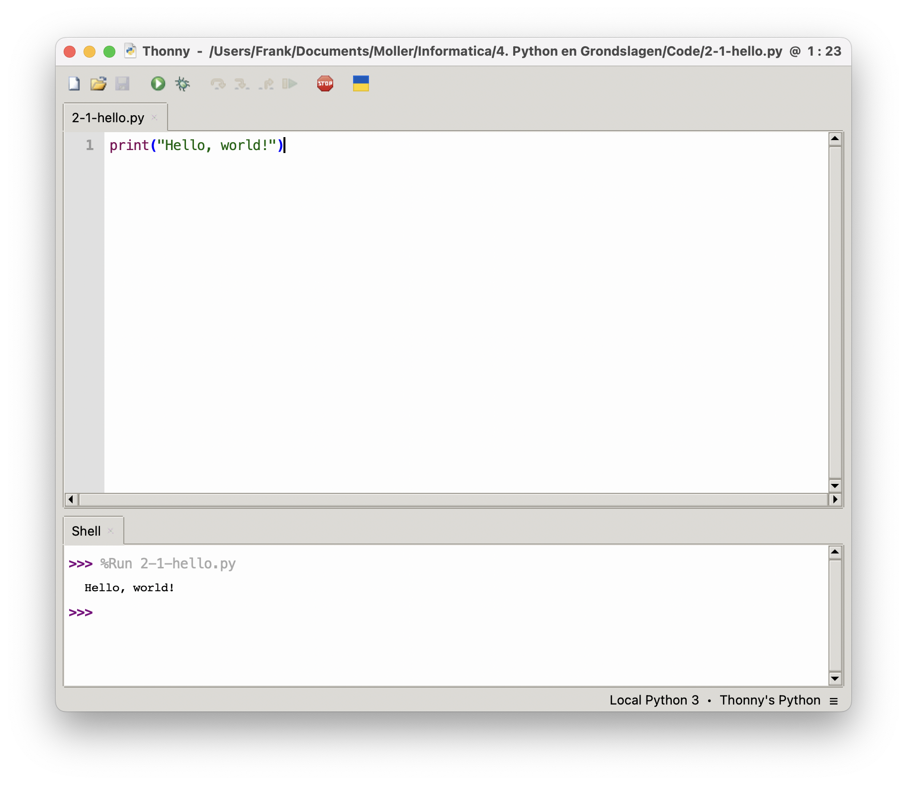

# Hello World!

Welkom bij je eerste programmeerles in Python! Vandaag ga je je allereerste
programma schrijven in de programmeertaal Python, met behulp van de
programmeeromgeving **Thonny**.

## Waarom "Hello World"?

Het eerste programma dat programmeurs vaak maken als ze een nieuwe
programmeertaal leren, is het beroemde **"Hello, World!"**-programma. Dit is een
soort traditie in de wereld van het programmeren. Het is een eenvoudige manier
om te laten zien dat alles werkt: de programmeertaal is correct geïnstalleerd,
de editor doet het, en je kunt iets uitvoeren. Je leert bovendien meteen hoe je
een stukje tekst op het scherm laat zien, wat in Python gebeurt met het commando
`print()`. Door te beginnen met iets simpels als "Hello, world!" kun je rustig
kennismaken met hoe programmeren werkt, zonder dat je al ingewikkelde dingen
hoeft te begrijpen.

Nieuwsgierig hoe dit programma eruitziet in andere talen? Op deze website kun je
[Hello World in meer dan 600 programmeertalen](https://helloworldcollection.github.io/)
bekijken!


---

## Opdracht

Je gaat een programma maken dat de tekst `Hello, world!` laat zien op het scherm.

### Stappen

1. Open **Thonny**.
2. Typ het volgende in het lege venster:
    ```python
    print("Hello, world!")
    ```
3. Druk op **F5** of klik op **de groene 'Run'-knop** (linksboven).
4. Sla je bestand op als `hello.py` wanneer hierom wordt gevraagd.
5. Bekijk de uitvoer onderin je scherm: je zou `Hello, world!` moeten zien!

<details>
   <summary>Klik hier om het gewenste resultaat te zien</summary>
   
   Als je alles goed gedaan hebt, ziet het er als volgt uit:
   
</details>

---

## Wat gebeurt hier?

De regel `print("Hello, world!")` is een opdracht aan de computer om een stukje
tekst op het scherm te tonen. Dat noemen we 'uitvoer'. In dit geval is
`"Hello, world!"` de tekst die wordt weergegeven. Zo’n stukje tekst noem je in
Python een *string*, en strings worden altijd tussen aanhalingstekens gezet. De
functie `print()` zorgt ervoor dat de tekst zichtbaar wordt in het
uitvoervenster onderin Thonny.

---

## Vervolg

Pas het programma aan zodat het **jou begroet** met je naam!

Bijvoorbeeld:
```python
print("Hello, Emma!")
```
