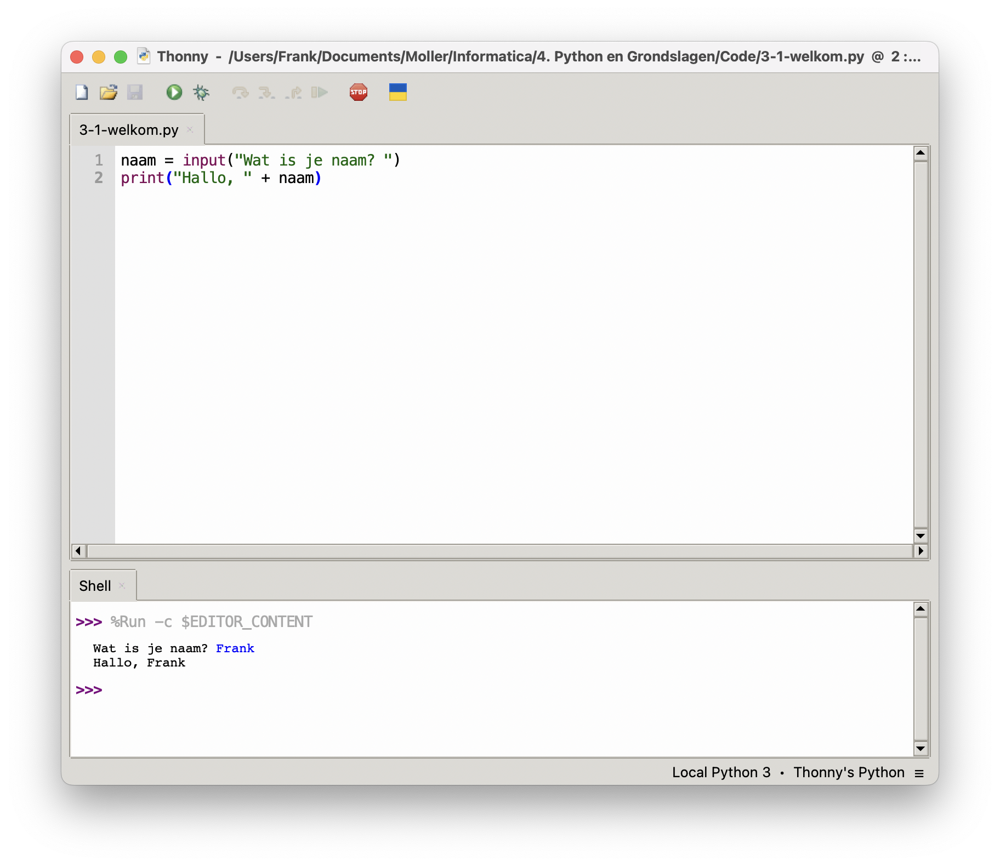

# Commentaar, Variabelen en Invoer

In deze les leer je hoe je variabelen gebruikt om gegevens op te slaan, hoe je
code van uitleg voorziet met commentaar, en hoe je de gebruiker om invoer kunt
vragen.


## Doel van deze les
- [ ] Begrijpen wat **commentaar** in code is en hoe je het gebruikt.  
- [ ] Werken met **variabelen** en het belang van duidelijke naamgeving.  
- [ ] Invoer vragen met **`input()`** en deze gebruiken in een programma.


## Commentaar in de code

Commentaar zijn stukjes tekst in je code die **niet worden uitgevoerd** door
Python. Ze helpen om je code te begrijpen en zijn handig als je later terugkijkt
op wat je hebt geschreven. In Python gebruik je een `#` om een regel als
commentaar te markeren. Dit zorgt ervoor dat de regel genegeerd wordt door de 
computer, maar wel nuttige informatie biedt voor jou en anderen die de code
lezen.

```python
# Dit is een commentaarregel
print("Dit wordt wel uitgevoerd")  # Dit is ook een commentaarregel
```

Voor langere uitleg kun je `"""` of `'''` gebruiken, zodat je meer context kunt
geven over hoe of waarom bepaalde code werkt. Door commentaar te gebruiken, maak
je je code niet alleen beter begrijpelijk, maar ook makkelijker om samen aan te
werken met anderen.

```python
"""
Dit is een lange uitleg.
Hier kun je meerdere regels commentaar geven.
"""
print("Dit is een Python-programma")
```


## Variabelen: Gegevens opslaan in Python

Een variabele is een naam die verwijst naar een stukje informatie in je
programma. Door variabelen te gebruiken, kun je waarden opslaan en later in het
programma opnieuw gebruiken. Dit maakt je code dynamischer en makkelijker aan te
passen. Bijvoorbeeld, als je de naam van een gebruiker opslaat in een variabele,
kun je die naam later gebruiken om een gepersonaliseerd bericht weer te geven.
Variabelen helpen ook om herhaling in je code te verminderen en maken het
eenvoudiger om veranderingen door te voeren zonder dat je overal in de code
aanpassingen hoeft te doen.

```python
naam = "Emma"
leeftijd = 16
```

Hier slaan we _"Emma"_ op in de variabele `naam` en het getal _16_ in de
variabele `leeftijd`. Als we deze variabelen printen:

```python
print(naam)
print(leeftijd)
```

Dan krijgen we als uitvoer:

```
Emma
16
```


## Naamgeving van variabelen

Het kiezen van goede namen voor variabelen is essentieel voor het schrijven van
leesbare en begrijpelijke code. Duidelijke variabelennamen zorgen ervoor dat je
direct ziet wat een variabele voorstelt, zonder dat je naar de inhoud hoeft te
kijken. Zo wordt `naam = "Emma"` direct begrepen, terwijl `a = "Emma"`
onduidelijk is. Daarnaast worden variabelen in Python meestal geschreven in
kleine letters met underscores (`_`) tussen woorden, zoals `leeftijd_gebruiker`.
Dit voorkomt verwarring en maakt de code gemakkelijker leesbaar. Er kunnen
**geen spaties** gebruikt worden in een variabele. Vermijd ook speciale tekens
en cijfers aan het begin van een variabelenaam, omdat dit tot fouten kan leiden.

```python
a = "Emma"        # ❌ Niet duidelijk
naam = "Emma"     # ✅ Veel beter!

leeftijd_gebruiker = 16  # ✅ Goed
leeftijdgebruiker = 16   # ❌ Moeilijker te lezen

1naam = "Emma"  # ❌ Fout!
naam1 = "Emma"  # ✅ Correct
```


## Invoer van de gebruiker

Met de **`input()`-functie** kun je de gebruiker om gegevens vragen. Dit maakt
je programma interactief, omdat het reageert op de invoer van de gebruiker. De
invoer die wordt ontvangen, wordt altijd als tekst behandeld.

```python
naam = input("Wat is je naam? ")
print("Hallo, " + naam)
```

<details>
   <summary>Voorbeeld Uitvoer</summary>
    

</details>


## Opdracht: Persoonlijke Begroeting

### Stappen

1. Vraag de gebruiker om zijn **naam** en **leeftijd**.
2. Sla de naam en leeftijd op in **variabelen**.
3. Gebruik `print()` om een bericht te tonen met de naam en leeftijd.

> **Voorbeeld:**
>
> **Invoer:**
> ```
> Wat is je naam? Emma  
> Hoe oud ben je? 16  
> ```  
>
> **Uitvoer:**
> ```
> Hallo Emma, jij bent 16 jaar oud!
> ```

> [!TIP]
> Gebruik `input()` om de gebruiker te vragen naar deze gegevens. De vraag komt
> in de shell te staan en daar kan je ook het antwoord typen.


## Klaar

Vraag de gebruiker waar hij/zij vandaan komt en voeg dat toe aan de begroeting.
